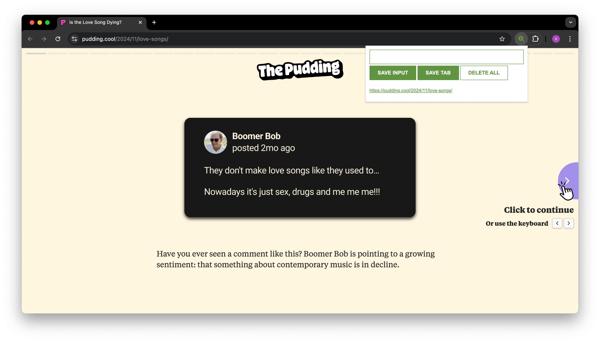
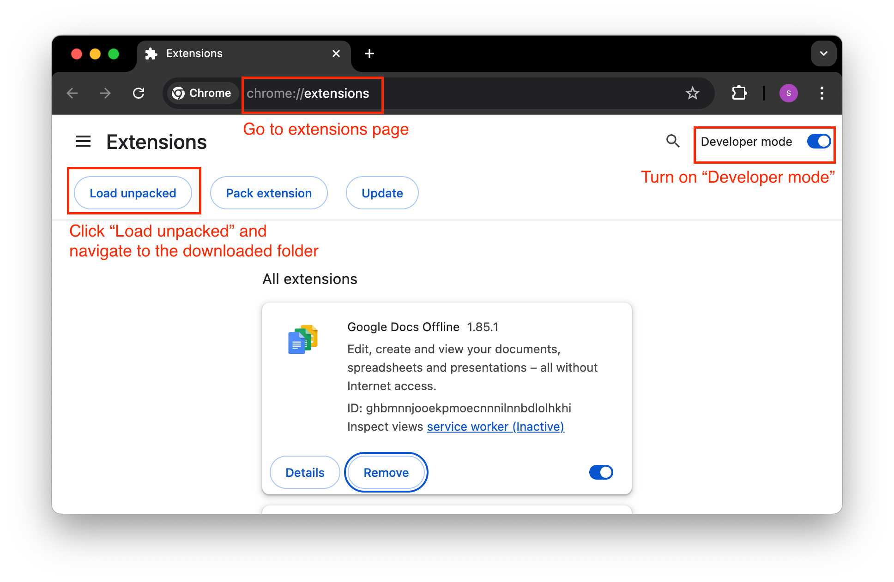
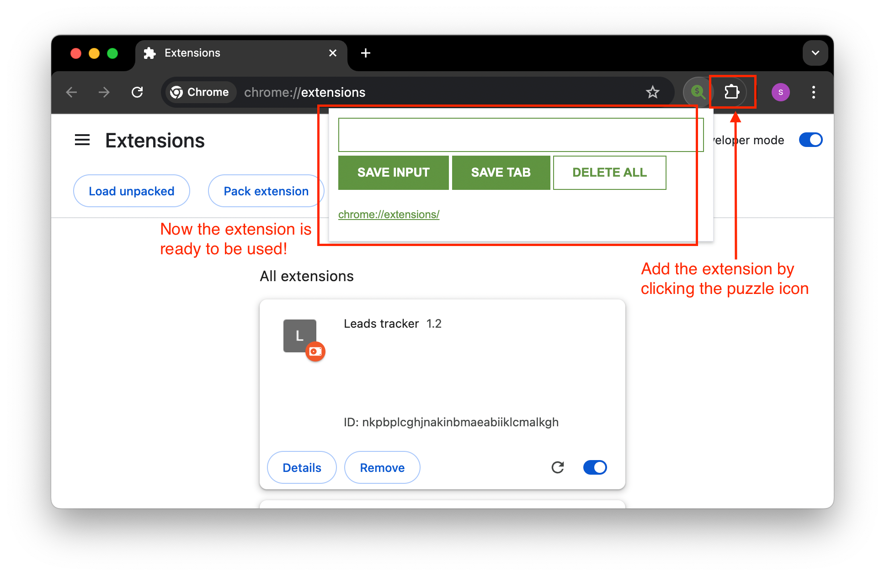

# Welcome! 👋 

## Lead Tracker Chrome Extension
Simple chrome extension to track possible leads.
Some simple functionality:
- `SAVE TAB` button saves the URL of the current active tab
- `SAVE INPUT` button saves the user text input
- `DELETE ALL` button deletes all saved leads

See it below in action!

## Quick Setup (Locally)
1. Download the code as zip or clone into local machine
2. Go to chrome://extensions/
3. Turn on "Developer mode"
4. Click "Load unpacked" and navigate to the downloaded folder

5. Add the extension to the chrome profile by clicking on the 'puzzle' icon

#### Here's the <a href="https://sarahhannes.github.io/chrome-ext-lead-tracker/" target="_blank">LINK</a> to play with it right now in your browser!

## Credits:
- The course: https://v1.scrimba.com/learn/learnjavascript
- The icon: https://fontawesome.com/icons/magnifying-glass-dollar?f=classic&s=solid
